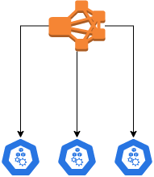

# Elastic search casus

On a simnple 3 node Kubernetes cluster

create your own setup of an elastic search stack according to the following simplified requirements:

The picture has been simplified on purpose. Its purpose is the let you play with this casus and see what  solutions you can come up with.

