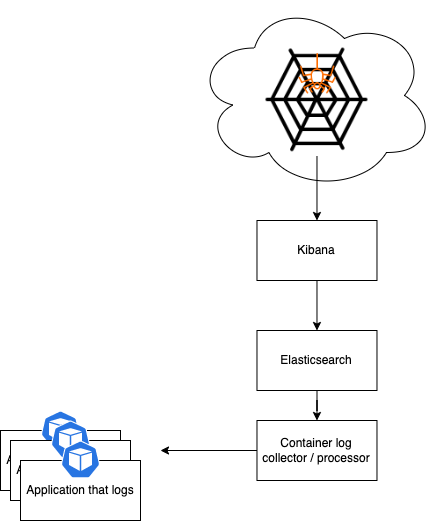

# Elastic search casus

Create your own setup of an elastic search stack according to the following simplified requirements:



The picture has been simplified on purpose. Its purpose is the let you play with this casus and see what  solutions you can come up with.

## Elastic search directly

port-forwarding to the pod and then use as localhost resource.

```shell
k port-forward SERVICE_NAME_HERE 9200:9200
```

```shell
curl -XGET 'http://localhost:9200/_cluster/health?level=indices&pretty'
```

```shell
curl -XGET 'http://localhost:9200/_cluster/health?level=shards&pretty'
```

```shell
curl -XGET http://localhost:9200/_cat/nodes?v
```

```shell
curl -XGET http://localhost:9200/_cat/master?v
```

```shell
curl -XGET http://localhost:9200/_cat/indices?v
```

# Get loadbalancer IP

Simplest way to get the loadbalancer IP is to use the `kubectl get svc` command and have a look at the `LoadBalancer` > `EXTERNAL-IP` field.

Others:

```shell
k get svc --no-headers|grep LoadBalancer|awk '{print $1}'|xargs -I{} kubectl -n $NS get svc {} -o jsonpath='{.status.loadBalancer.ingress[0].ip}'
```
```shell
k get service --no-headers | grep LoadBalance | awk '{print $4}'
```

# Backup your k8s cluster

see:

```shell
./bin/backup-k8s.sh
```